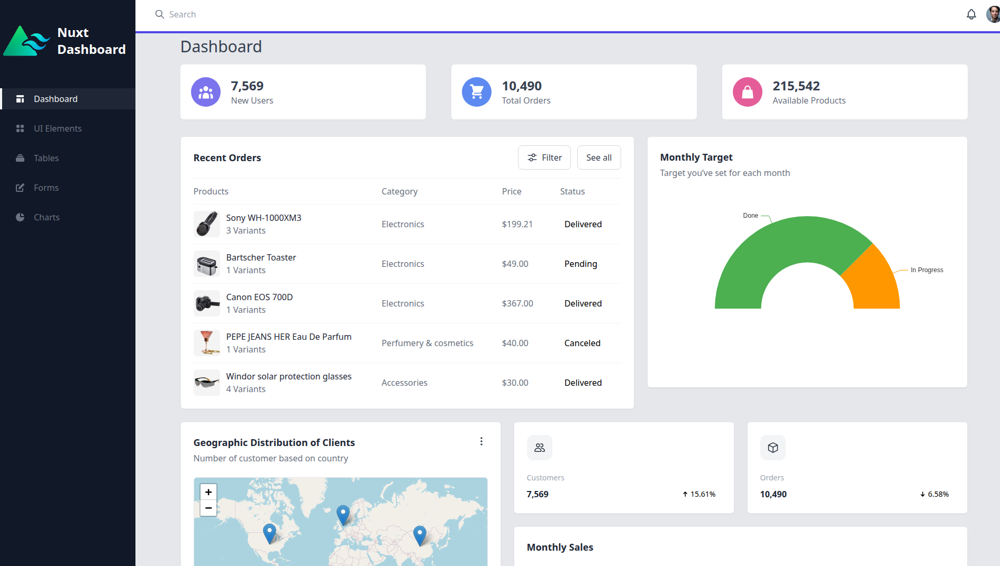

# Nuxt Dashboard Template with Tailwind


> ⚠️ **WORK IN PROGRESS**  
> This template is currently under active development.

A **Nuxt 3** dashboard template styled with **Tailwind CSS** and developed with **Yarn**.

## 🚀 Features
- Multiple pages
- Built with [Nuxt 3](https://nuxt.com/), [Tailwind CSS](https://tailwindcss.com/), [Leaflet](https://leafletjs.com/), and [ECharts](https://echarts.apache.org/)

## 🔎 Preview


🚀 **[Live Demo](https://aelmizeb.github.io/nuxt-dashboard/)**


## ✨ Quick Start

Clone this project:

```bash
git clone https://github.com/aelmizeb/nuxt-dashboard.git
cd nuxt-dashboard
yarn install
yarn dev
```

## 🧩 Deployment
This project is automatically deployed on GitHub Pages at:
👉 https://aelmizeb.github.io/nuxt-dashboard/

To manually generate the static site:

```bash
yarn generate
```

Output will be in .output/public/, ready for deployment.

More info on Nuxt deployment documentation.


Look at the [Nuxt documentation](https://nuxt.com/docs/getting-started/introduction) to learn more.

## 🛠 Setup

Make sure to install dependencies:

```bash
# npm
npm install

# pnpm
pnpm install

# yarn
yarn install

# bun
bun install
```

## 💻 Development Server

Start the development server on `http://localhost:3000`:

```bash
# npm
npm run dev

# pnpm
pnpm dev

# yarn
yarn dev

# bun
bun run dev
```

## 📦 Production

Build the application for production:

```bash
# npm
npm run build

# pnpm
pnpm build

# yarn
yarn build

# bun
bun run build
```

Locally preview production build:

```bash
# npm
npm run preview

# pnpm
pnpm preview

# yarn
yarn preview

# bun
bun run preview
```

Check out the [deployment documentation](https://nuxt.com/docs/getting-started/deployment) for more information.

## 🤝 Contributing
Contributions are welcome!
If you'd like to contribute:

- Fork the repository
- Create your feature branch (git checkout -b feature/my-feature)
- Commit your changes (git commit -m 'Add new feature')
- Push to the branch (git push origin feature/my-feature)
- Open a Pull Request

<!--## 👨‍💻 Contributors

[](https://github.com/aelmizeb/nuxt-dashboard/graphs/contributors)-->


## 🛡 License
This project is licensed under the MIT License.
